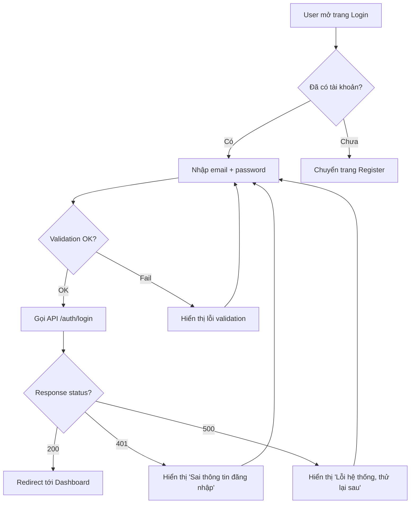
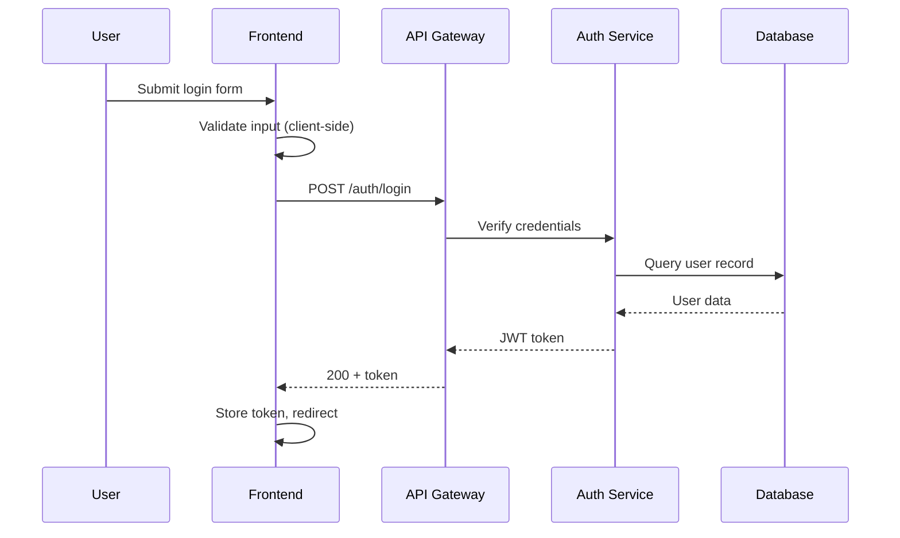

# Skill: Flow Designer (UserFlow / SystemFlow)

## KÍCH HOẠT

Khi cần draft hoặc update UserFlow/SystemFlow.

## DEPENDENCY CHECK
Trước khi thực hiện thiết kế flow:
1. Chạy `python scripts/pdt.py status` để kiểm tra trạng thái PRD.
2. Nếu PRD chưa có hoặc chưa approved, đưa ra cảnh báo cho user, nhưng vẫn tiếp tục thiết kế nếu có yêu cầu.

## PERSONA ACTIVE: `UX_Architect` + `QA_Skeptic`

UX_Architect thiết kế happy path tối ưu. QA_Skeptic thách thức mọi edge case.

## QUY TRÌNH

### Bước 1: Xác định loại flow

| Loại | Mục đích | Notation |
|---|---|---|
| UserFlow | Hành trình user qua các screen/action | Mermaid flowchart |
| SystemFlow | Tương tác giữa services/components | Mermaid sequence diagram |
| StateFlow | Trạng thái của entity qua lifecycle | Mermaid state diagram |

### Bước 2: Thiết kế Happy Path

TỪ PRD requirements, XÂY DỰNG luồng chính:
- Mỗi node = 1 hành động hoặc 1 screen
- Mỗi edge = 1 transition rõ ràng
- Maximum 10 nodes cho happy path (nếu vượt → tách thành sub-flows)

### Bước 3: Thêm Error Paths (QA_Skeptic)

MỖI flow PHẢI có minimum 2 error paths:

QA_Skeptic challenge:
- "Nếu network timeout tại bước N?"
- "Nếu validation fail tại bước N?"
- "Nếu user quay lại bước trước?"
- "Nếu session hết hạn giữa chừng?"
- "Nếu concurrent request xảy ra?"

### Bước 4: Viết Mermaid Diagram

**UserFlow example:**

**SystemFlow example:**

### Bước 5: Document Flow

TẠO file `docs/flows/[flow-name].md` theo template `docs/flows/_TEMPLATE.md`.

Sau khi ghi file, BẮT BUỘC thực hiện:
- Chạy `python scripts/pdt.py status --update` để cập nhật trạng thái.
- Chạy `python scripts/pdt.py log --add "Thiết kế flow [flow-name]" --artifact "Flows"`

---

## QUY TẮC

1. MỖI flow minimum: 1 happy path + 2 error paths
2. MAXIMUM 10 nodes trên happy path - tách sub-flow nếu vượt
3. MỖI node có label rõ ràng, dạng hành động ("User nhấn nút X", "System gọi API Y")
4. TRÍCH DẪN PRD requirement cho mỗi flow
5. LIÊN KẾT tới mockup screens tương ứng
6. MERMAID syntax valid - test render trước khi commit
7. QA_Skeptic PHẢI review và thêm edge cases
8. ĐỒNG BỘ TRẠNG THÁI: Luôn chạy `pdt.py status --update` sau khi lưu file.

## CHUYỂN GIAO

→ Flows approved → Input cho Mockup Designer (screen mapping)
→ Flows là reference cho: SRS (behavior specs), TDD (interaction sequences)
