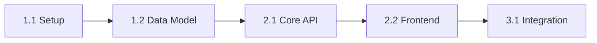

# Skill: Handoff Package

## KÍCH HOẠT

Khi tất cả artifacts đã qua Review Gate (`status: approved` hoặc user chấp nhận risk).

## PERSONA ACTIVE: `Spec_Steward` + `Product_Strategist`

Spec_Steward verify completeness. Product_Strategist prioritize implementation order.

## QUY TRÌNH

### Bước 1: Artifact Verification

Chạy `python scripts/pdt.py status` để kiểm tra trạng thái và in checklist:

```markdown
## Artifact Checklist (Đọc từ STATUS.md)
[Chèn phần nội dung tương ứng từ STATUS.md]
```

GHI RÕ status từng artifact.

### Bước 2: Consistency Check

BẮT BUỘC chạy check:
```bash
python scripts/pdt.py verify
python scripts/pdt.py sync
```
Ghi nhận kết quả verify và sync vào handoff package. Ghi rõ inconsistencies hoặc warnings nếu phát hiện.

### Bước 3: Tạo Implementation Plan

TẠO file `handoff/[feature-name]/IMPLEMENTATION_PLAN.md`:

```markdown
---
feature: [Tên feature]
created: YYYY-MM-DD
source_docs:
  - docs/prd/[feature].md
  - docs/srs/[feature].md
  - docs/tdd/[feature].md
handoff_status: ready | blocked
---

# Implementation Plan: [Tên feature]

## Trạng thái Pipeline
- HOÀN THÀNH: [Liệt kê tất cả design artifacts đã complete]
- ĐANG LÀM: Handoff packaging
- TIẾP THEO: Implementation by development team
- BLOCKED: [Nếu có, liệt kê blockers]

## Tổng quan
[1 paragraph mô tả feature, business value, scope]
[Nguồn: PRD Executive Summary]

## Kiến trúc tổng quan
[Tóm tắt từ TDD, kèm diagram reference]
[Nguồn: TDD Section 1]

## Task Breakdown

### Phase 1: Foundation
| # | Task | Mô tả | Dependencies | SRS Ref | Effort |
|---|---|---|---|---|---|
| 1.1 | [Task name] | [Chi tiết] | None | FR-001 | [S/M/L] |
| 1.2 | [Task name] | [Chi tiết] | 1.1 | FR-002 | [S/M/L] |

### Phase 2: Core Features
| # | Task | Mô tả | Dependencies | SRS Ref | Effort |
|---|---|---|---|---|---|
| 2.1 | [Task name] | [Chi tiết] | 1.x | FR-003 | [S/M/L] |

### Phase 3: Integration & Polish
| # | Task | Mô tả | Dependencies | SRS Ref | Effort |
|---|---|---|---|---|---|

## Dependency Graph
[Mermaid graph showing task dependencies]



## Acceptance Criteria per Task
### Task 1.1: [Name]
- [ ] AC: [Tiêu chí cụ thể, đo lường được]
- [ ] AC: [Tiêu chí cụ thể, đo lường được]
[Nguồn: PRD REQ-XXX AC-XXX-X]

## Design Decisions Summary
[Tóm tắt ADRs quan trọng mà implementation team cần biết]
| ADR | Quyết định | Lý do ngắn | Impact |
|---|---|---|---|
| ADR-001 | [Decision] | [Why] | [Components affected] |

## Mockup Reference
[Links tới mockup pages và component mapping]
| Screen | Mockup File | PRD Refs |
|---|---|---|
| [Screen name] | mockups/src/pages/[Page].tsx | REQ-001, REQ-002 |

## Risks & Notes cho Implementation Team
- [Risk 1 + mitigation]
- [Risk 2 + mitigation]
- [Technical notes]

## Recommended Implementation Order
1. [Phase 1 rationale]
2. [Phase 2 rationale]
3. [Phase 3 rationale]
```

### Bước 4: Bundle Artifacts

TẠO thư mục `handoff/[feature-name]/` với:
```
handoff/[feature-name]/
├── IMPLEMENTATION_PLAN.md      # Plan chính (file trên)
├── QUICK_START.md              # Hướng dẫn nhanh cho dev team
├── artifacts/                  # Symlinks hoặc copies
│   ├── prd.md → ../../docs/prd/[feature].md
│   ├── srs.md → ../../docs/srs/[feature].md
│   ├── tdd.md → ../../docs/tdd/[feature].md
│   └── flows/
└── decisions/                  # Relevant ADRs
```

### Bước 5: Quick Start Guide

TẠO `handoff/[feature-name]/QUICK_START.md`:

```markdown
# Quick Start: [Feature Name]

## Đọc gì trước?
1. IMPLEMENTATION_PLAN.md (5 phút) → tổng quan tasks và order
2. TDD (15 phút) → architecture và component design
3. Mockups (10 phút) → `cd mockups && npm run dev` → xem UI

## Bắt đầu code
1. Đọc Task 1.1 trong Implementation Plan
2. Reference SRS FR-IDs cho specifications
3. Reference TDD cho technical approach
4. Reference Mockup cho UI behavior

## Hỏi gì?
- Business logic unclear → check PRD
- Technical decision why → check ADRs in decisions/
- User flow unclear → check docs/flows/
- UI behavior unclear → run mockup dev server
```

## QUY TẮC

1. **Gate Verification**: Chỉ tiến hành handoff khi Review Gate đạt status `PASSED` hoặc `PASSED WITH WARNINGS` (user đồng ý).
2. **IMPLEMENTATION PLAN**: Bắt buộc có task breakdown, dependency graph (Mermaid), và acceptance criteria mapped với SRS.
3. **STATUS AT HANDOFF**: Phải đính kèm bản sao của `docs/STATUS.md` vào thư mục `handoff/[feature-name]/STATUS.md`.
4. **TRÍCH DẪN**: Ghi rõ mã FR-ID/NFR-ID cho mỗi task trong plan.
5. **ĐỒNG BỘ & LOGGING**:
   - Chạy `python scripts/pdt.py status --update` trước khi đóng gói.
   - Chạy `python scripts/pdt.py log --add "Đóng gói Handoff cho [feature-name]" --artifact "Handoff"` sau khi hoàn thành.
