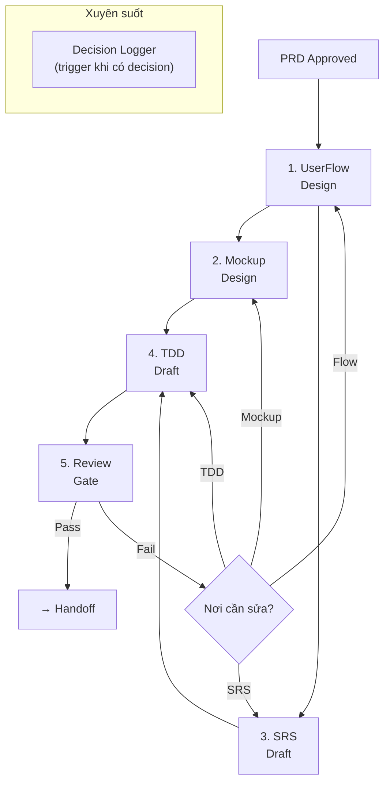

# Workflow: Design Cycle

> PRD Approved → UserFlow → Mockup → TDD → SRS → Decision Records → Review Gate

## PIPELINE

## CONTEXT AWARENESS

TRƯỚC MỖI STEP, agent PHẢI:

1. **CHECK STATUS**: Chạy `python scripts/pdt.py status` để biết artifacts nào đã có.
2. **CHECK PRIORITIES**: Chạy `python scripts/pdt.py priority` để xem recommend task tiếp theo.
3. **CHECK SYNC**: Chạy `python scripts/pdt.py sync` để đảm bảo không bị stale.

## CHI TIẾT TỪNG STEP

### Step 1: UserFlow Design

**Skill**: [flow-designer/SKILL.md](../skills/flow-designer/SKILL.md)

**Input**: PRD approved (`docs/prd/[feature].md`)

**Hành động**:
1. EXTRACT user stories từ PRD
2. DESIGN happy path cho mỗi core story
3. QA_Skeptic thêm 2+ error paths per flow
4. TẠO Mermaid diagrams
5. CẬP NHẬT TRẠNG THÁI:
   - Chạy `python scripts/pdt.py status --update`
   - Chạy `python scripts/pdt.py log --add "Tạo UserFlow cho [feature-name]" --artifact "Flows"`

**Output**: `docs/flows/[flow-name].md` (1+ files)

**Transition**: Flows có happy path + error paths → chuyển Step 2 + 3 (parallel/flexible)

---

### Step 2: Mockup Design

**Skill**: [mockup-designer/SKILL.md](../skills/mockup-designer/SKILL.md)

**Input**: Flows approved + PRD requirements

**Hành động**:
1. Brief Inference (taste-skill Section 0)
2. Atomic Design mapping (atoms → pages)
3. Implement components
4. Pre-flight check (taste-skill Section 14)
5. CẬP NHẬT TRẠNG THÁI:
   - Chạy `python scripts/pdt.py status --update`
   - Chạy `python scripts/pdt.py log --add "Cập nhật Mockups cho [feature-name]" --artifact "Mockup"`

**Output**: `mockups/src/` components và pages

**Transition**: Mockup pre-flight passed → chuyển Step 4

**Decision trigger**: Nếu gặp trade-off UI → KÍCH HOẠT Decision Logger, tạo ADR.

---

### Step 3: SRS Draft

**Skill**: [srs-writer/SKILL.md](../skills/srs-writer/SKILL.md)

**Input**: PRD approved

**Hành động**:
1. PHÂN LOẠI requirements: FR, NFR, IR, DR
2. VIẾT specifications chi tiết
3. TẠO traceability matrix
4. CẬP NHẬT TRẠNG THÁI:
   - Chạy `python scripts/pdt.py status --update`
   - Chạy `python scripts/pdt.py log --add "Draft SRS cho [feature-name]" --artifact "SRS"`

**Output**: `docs/srs/[feature].md` (status: draft)

**Transition**: SRS traceability matrix 100% mapped → chuyển Step 4

---

### Step 4: TDD Draft

**Skill**: [tdd-writer/SKILL.md](../skills/tdd-writer/SKILL.md)

**Input**: SRS draft + Decision Records + Flows + Mockup component structure

**Hành động**:
1. ARCHITECTURE design dựa trên SRS
2. COMPONENT design dựa trên Mockup structure
3. DATA MODEL dựa trên SRS data requirements
4. TRADE-OFF analysis cho mỗi decision
5. CẬP NHẬT TRẠNG THÁI:
   - Chạy `python scripts/pdt.py status --update`
   - Chạy `python scripts/pdt.py log --add "Draft TDD cho [feature-name]" --artifact "TDD"`

**Output**: `docs/tdd/[feature].md` (status: draft)

**Transition**: TDD draft hoàn chỉnh + trade-offs documented → chuyển Step 5

**Decision trigger**: Mọi architectural decision → KÍCH HOẠT Decision Logger.

---

### Step 5: Review Gate

**Workflow**: [review-gate.md](review-gate.md)

Chạy full review gate checks. Nếu fail → xác định step cần quay lại.

---

## DECISION LOGGING (Xuyên suốt)

**Skill**: [decision-logger/SKILL.md](../skills/decision-logger/SKILL.md)

KÍCH HOẠT tự động khi có quyết định quan trọng. Sau khi tạo ADR:
- Chạy `python scripts/pdt.py status --update`
- Chạy `python scripts/pdt.py log --add "Tạo ADR-[NNN] cho [decision-title]" --artifact "Decisions"`

TẠO ADR trong `docs/decisions/` và LINK tới relevant docs.

## QUY TẮC

1. **LỰA CHỌN LINH HOẠT**: Các step chạy dựa trên graph dependency, không ép buộc thứ tự tuyến tính. User có thể drafting song song nhiều file.
2. **TRACKING BẮT BUỘC**: Chạy `python scripts/pdt.py status --update` sau mỗi lần lưu/sửa file để đồng bộ docs/STATUS.md.
3. **LOG ACTIONS**: Ghi nhận log qua `pdt.py log` cho tất cả thay đổi cấu trúc/requirements.
4. **SYNC CHECK**: Nếu có chỉnh sửa ngược (ví dụ: đổi thiết kế ở Mockup ảnh hưởng PRD/SRS) → BẮT BUỘC chạy workflow [Sync Check](sync-check.md).
