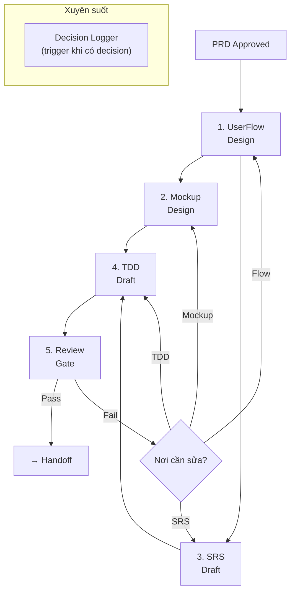

# Workflow: Design Cycle

> PRD Approved → UserFlow → Mockup → TDD → SRS → Decision Records → Review Gate

## PIPELINE



## CONTEXT AWARENESS

TRƯỚC MỖI STEP, agent PHẢI:

1. **SCAN** toàn bộ `docs/` để biết artifacts nào đã tồn tại
2. **READ** PRD target để xác định scope
3. **STATE** pipeline status:

```
## Trạng thái Pipeline
- HOÀN THÀNH: Feature Intake ✓, PRD Approved ✓, [các steps khác]
- ĐANG LÀM: [Step hiện tại]
- TIẾP THEO: [Steps còn lại]
- BLOCKED: [Nếu có]
- DECISIONS PENDING: [ADRs cần resolved]
```

## CHI TIẾT TỪNG STEP

### Step 1: UserFlow Design

**Skill**: [flow-designer/SKILL.md](../skills/flow-designer/SKILL.md)

**Input**: PRD approved (`docs/prd/[feature].md`)

**Hành động**:
1. EXTRACT user stories từ PRD
2. DESIGN happy path cho mỗi core story
3. QA_Skeptic thêm 2+ error paths per flow
4. TẠO Mermaid diagrams

**Output**: `docs/flows/[flow-name].md` (1+ files)

**Transition**: Flows có happy path + error paths → chuyển Step 2 + 3 (parallel)

---

### Step 2: Mockup Design (song song với Step 3)

**Skill**: [mockup-designer/SKILL.md](../skills/mockup-designer/SKILL.md)

**Input**: Flows approved + PRD requirements

**Hành động**:
1. Brief Inference (taste-skill Section 0)
2. Atomic Design mapping (atoms → pages)
3. Implement components
4. Pre-flight check (taste-skill Section 14)

**Output**: `mockups/src/` components và pages

**Transition**: Mockup pre-flight passed → chuyển Step 4

**Decision trigger**: Nếu gặp trade-off UI (ví dụ: modal vs. page, tab vs. accordion) → KÍCH HOẠT Decision Logger, tạo ADR.

---

### Step 3: SRS Draft (song song với Step 2)

**Skill**: [srs-writer/SKILL.md](../skills/srs-writer/SKILL.md)

**Input**: PRD approved

**Hành động**:
1. PHÂN LOẠI requirements: FR, NFR, IR, DR
2. VIẾT specifications chi tiết
3. TẠO traceability matrix

**Output**: `docs/srs/[feature].md` (status: draft)

**Transition**: SRS traceability matrix 100% mapped → chuyển Step 4

---

### Step 4: TDD Draft

**Skill**: [tdd-writer/SKILL.md](../skills/tdd-writer/SKILL.md)

**Input**: SRS draft + Decision Records + Flows + Mockup component structure

**Hành động**:
1. ARCHITECTURE design dựa trên SRS
2. COMPONENT design dựa trên Mockup structure
3. DATA MODEL dựa trên SRS data requirements
4. TRADE-OFF analysis cho mỗi decision

**Output**: `docs/tdd/[feature].md` (status: draft)

**Transition**: TDD draft hoàn chỉnh + trade-offs documented → chuyển Step 5

**Decision trigger**: Mọi architectural decision → KÍCH HOẠT Decision Logger.

---

### Step 5: Review Gate

**Workflow**: [review-gate.md](review-gate.md)

Chạy full review gate checks. Nếu fail → xác định step cần quay lại.

---

## DECISION LOGGING (Xuyên suốt)

**Skill**: [decision-logger/SKILL.md](../skills/decision-logger/SKILL.md)

KÍCH HOẠT tự động khi:
- Chọn giữa 2+ phương án kỹ thuật hoặc UX
- User override một recommendation
- Trade-off xuất hiện giữa requirements

TẠO ADR trong `docs/decisions/` và LINK tới relevant docs.

## QUY TẮC

1. STEP 2 + 3 có thể chạy SONG SONG (không phụ thuộc nhau)
2. STEP 4 YÊU CẦU output từ cả Step 2 và 3
3. MỖI step CẬP NHẬT pipeline status
4. DECISION LOGGER kích hoạt bất kỳ lúc nào, không phụ thuộc step sequence
5. ITERATION: Review Gate fail → quay lại step specific, không restart toàn bộ
