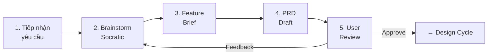

# Workflow: Feature Intake

> Nhận yêu cầu tính năng mới từ user → Brainstorm → Feature Brief → PRD Draft → User Review

## PIPELINE

## CONTEXT AWARENESS

TRƯỚC KHI bắt đầu, chạy `python scripts/pdt.py status` để kiểm tra trạng thái hiện tại.

## CHI TIẾT TỪNG STEP

### Step 1: Tiếp nhận yêu cầu

**Input**: User request (text, link, ý tưởng, vấn đề)

**Hành động**:
1. PARSE yêu cầu thành: Vấn đề gốc, Giải pháp đề xuất, Ngữ cảnh ngầm
2. CHECK docs hiện có: xem feature có overlap với PRDs đã tồn tại
3. GHI NHẬN nguyên văn user request cho citation

**Output**: Structured intake summary

**Transition condition**: Intake summary đã ghi → chuyển Step 2

---

### Step 2: Brainstorm (Socratic)

**Skill sử dụng**: [brainstorm/SKILL.md](../skills/brainstorm/SKILL.md)

**Hành động**:
1. ĐẶT 3-5 câu hỏi Socratic từ 3 personas
2. CHỜ user trả lời
3. PHÂN TÍCH đa chiều (Business, UX, Technical)

**Output**: Multi-persona analysis

**Transition condition**: User đã trả lời đủ câu hỏi HOẶC agent có đủ context để phân tích → chuyển Step 3

---

### Step 3: Feature Brief

**Skill sử dụng**: [brainstorm/SKILL.md](../skills/brainstorm/SKILL.md) (Bước 4)

**Hành động**:
1. TẠO Feature Brief theo format trong skill tại `docs/features/[feature-name]-brief.md`
2. LIỆT KÊ câu hỏi mở (nếu còn)
3. TRÌNH user review Feature Brief
4. CẬP NHẬT TRẠNG THÁI:
   - Chạy `python scripts/pdt.py status --update` để ghi nhận Feature Brief mới.
   - Chạy `python scripts/pdt.py log --add "Tạo Feature Brief [feature-name]" --artifact "Feature Brief"`

**Output**: `docs/features/[feature-name]-brief.md`

**Transition condition**: Feature Brief approved bởi user, tất cả câu hỏi mở đã giải quyết → chuyển Step 4

---

### Step 4: PRD Draft

**Skill sử dụng**: [prd-writer/SKILL.md](../skills/prd-writer/SKILL.md)

**Hành động**:
1. TẠO PRD draft từ Feature Brief
2. FORMAT requirements theo REQ-ID convention
3. THÊM acceptance criteria cho mỗi requirement
4. CẬP NHẬT TRẠNG THÁI:
   - Chạy `python scripts/pdt.py status --update`
   - Chạy `python scripts/pdt.py log --add "Draft PRD cho [feature-name]" --artifact "PRD"`

**Output**: `docs/prd/[feature-name].md` (status: draft)

**Transition condition**: PRD draft hoàn chỉnh → chuyển Step 5

---

### Step 5: User Review

**Hành động**:
1. TRÌNH PRD draft cho user
2. HIGHLIGHT các decision points cần input
3. GHI NHẬN feedback
4. KHI USER APPROVED:
   - Thay đổi `status: approved` trong frontmatter của PRD.
   - Chạy `python scripts/pdt.py status --update`
   - Chạy `python scripts/pdt.py log --add "Approved PRD cho [feature-name]" --artifact "PRD"`

**Output**: PRD với status = approved

**Transition conditions**:
- User approve → chuyển sang **Design Cycle** workflow
- User có feedback → quay lại Step 2 hoặc Step 4 tùy scope feedback

---

## QUY TẮC WORKFLOW

1. MỖI step GHI RÕ trạng thái dự án (sử dụng `pdt.py status`)
2. CHUYỂN step linh hoạt, không block cứng nhưng cần thông báo nếu thiếu dependencies.
3. CITATION: mỗi output trích nguồn từ step trước
4. LOGGING: Sử dụng `pdt.py log` cho mọi thay đổi quan trọng của tài liệu.
5. UPDATE HUB: Luôn chạy `pdt.py status --update` để giữ docs/STATUS.md đồng bộ.
