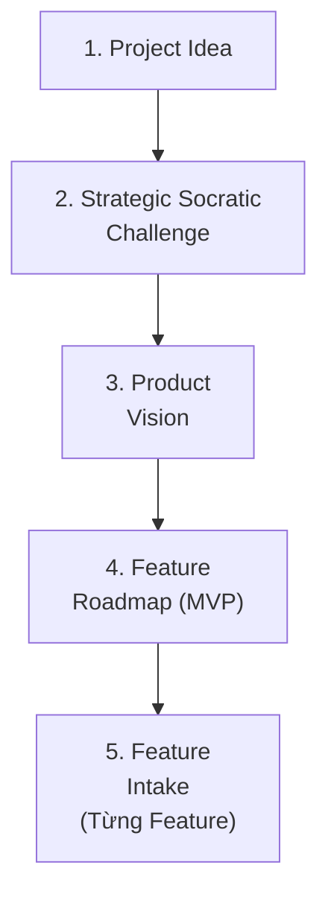

# Workflow: Project Bootstrapping

> Khi người dùng cung cấp ý tưởng cho một dự án/sản phẩm lớn (Project Idea) thay vì chỉ một tính năng (Feature).

## PIPELINE

## CONTEXT AWARENESS

TRƯỚC KHI bắt đầu, chạy `python scripts/pdt.py status` để kiểm tra các tài liệu hiện có (đặc biệt là trạng thái của Vision).

## CHI TIẾT TỪNG STEP

### Step 1: Tiếp nhận Project Idea

**Input**: User request về một hệ thống mới, một ứng dụng mới.

**Hành động**:
1. PARSE ý tưởng thành: Vấn đề cốt lõi, Khách hàng mục tiêu, Ngữ cảnh công nghệ mong muốn.
2. GHI NHẬN nguyên văn ý tưởng để làm trích dẫn (citation) về sau.

**Output**: Project Intake summary (giữ trong session memory).

**Transition**: Chuyển Step 2.

---

### Step 2: Strategic Socratic Challenge

**Skill sử dụng**: [project-bootstrapping/SKILL.md](../skills/project-bootstrapping/SKILL.md)

**Hành động**:
1. ĐẶT 3-5 câu hỏi Socratic ở mức độ VĨ MÔ từ các persona:
   - `Product_Strategist`: Mô hình kinh doanh, North Star Metric.
   - `UX_Architect`: Nguyên tắc thiết kế chính (Design Principles).
   - `Tech_Advisor`: Stack, Scalability, Security.
2. TỔNG HỢP phân tích đa chiều (Multi-persona analysis).

**Output**: Multi-persona strategic analysis.

**Transition**: User trả lời đầy đủ → chuyển Step 3.

---

### Step 3: Product Vision

**Skill sử dụng**: [project-bootstrapping/SKILL.md](../skills/project-bootstrapping/SKILL.md) (kết hợp `competitor-analysis/SKILL.md`)

**Hành động**:
1. DỰA TRÊN kết quả Step 2, điền đầy đủ thông tin vào file `docs/vision/VISION.md`.
2. ĐẢM BẢO đủ 9 phần yêu cầu của Vision.
3. CẬP NHẬT TRẠNG THÁI:
   - Chạy `python scripts/pdt.py status --update`
   - Chạy `python scripts/pdt.py log --add "Khởi tạo Product Vision" --artifact "Vision"`

**Output**: `docs/vision/VISION.md` (status: approved)

**Transition**: Vision approved → chuyển Step 4.

---

### Step 4: Feature Roadmap (MVP Deconstruction)

**Hành động**:
1. TỪ phần "7. Phạm vi MVP" trong Vision, BÓC TÁCH (deconstruct) thành danh sách các Core Features.
2. ĐÁNH GIÁ ĐỘ ƯU TIÊN cho các tính năng này để xây dựng Roadmap.
3. TRÌNH BÀY Roadmap cho user duyệt.

**Output**: Feature Roadmap (liệt kê danh sách).

**Transition**: User chọn Feature đầu tiên → Kích hoạt **[Feature Intake](feature-intake.md)** workflow.

---

## QUY TẮC WORKFLOW

1. Mọi thay đổi về định hướng dự án đều phải được cập nhật lại vào `VISION.md`.
2. Không khởi động Feature Intake nếu `VISION.md` chưa hoàn thiện và được phê duyệt.
