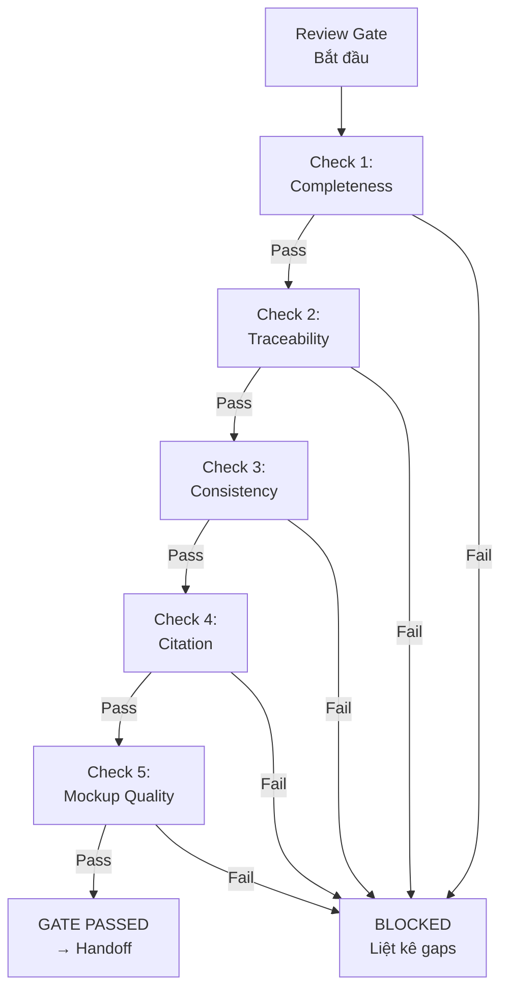

# Workflow: Review Gate

> Kiểm tra completeness, traceability, consistency trước khi cho phép chuyển sang Handoff.

## GATE CONDITIONS

Tất cả conditions PHẢI pass. Một fail = block handoff.



## CHECK DETAILS

### Check 1: Completeness

SCAN từng artifact type và verify:

```markdown
## Completeness Report
| Artifact | File | Status | Required Sections | Missing |
|---|---|---|---|---|
| PRD | docs/prd/[f].md | approved | 11/11 | None |
| SRS | docs/srs/[f].md | draft | 5/6 | Section 4: Data Model |
| TDD | docs/tdd/[f].md | draft | 9/9 | None |
| Flows | docs/flows/ | approved | 3 flows | None |
| Mockups | mockups/src/ | built | 5 pages | Page: Settings |
| Decisions | docs/decisions/ | accepted | 3 ADRs | None |
| Glossary | docs/GLOSSARY.md | current | - | None |
```

**Pass condition**: Tất cả artifacts tồn tại, tất cả required sections filled, status ≥ `draft`.

### Check 2: Traceability

VERIFY truy ngược hoàn chỉnh:

```markdown
## Traceability Matrix Check
| PRD REQ-ID | SRS FR/NFR | TDD Component | Flow | Mockup Screen | Status |
|---|---|---|---|---|---|
| REQ-001 | FR-001 | UserAuth | login-flow | LoginPage | ✓ Full |
| REQ-002 | FR-002 | Dashboard | - | DashboardPage | ⚠ Missing Flow |
| REQ-003 | NFR-001 | - | - | - | ✗ Missing SRS+TDD |
```

**Pass condition**: 100% PRD REQ-IDs mapped tới ít nhất SRS + TDD. Flows và Mockups coverage ≥ 80%.

### Check 3: Consistency

DETECT contradictions giữa các artifacts:

**Checks thực hiện**:
1. PRD scope vs. SRS scope: cùng danh sách features?
2. SRS data model vs. TDD data model: cùng entities, fields?
3. SRS API contracts vs. TDD API design: cùng endpoints, schemas?
4. Flows vs. Mockups: tất cả screens trong flow có mockup?
5. ADR decisions vs. TDD architecture: TDD thực hiện đúng decisions?
6. NFR performance targets vs. TDD performance budget: consistent numbers?

```markdown
## Consistency Report
| Check | Source A | Source B | Status | Issue |
|---|---|---|---|---|
| Scope match | PRD | SRS | ✓ | - |
| Data model | SRS | TDD | ⚠ | SRS có field "role", TDD thiếu |
| API contracts | SRS | TDD | ✓ | - |
| Screen coverage | Flows | Mockups | ✗ | Flow "forgot-password" chưa có mockup |
```

**Pass condition**: Zero ✗ (contradictions). ⚠ (warnings) acceptable nếu documented.

### Check 4: Citation

SCAN tất cả docs và verify citation-enforced:

**Checks thực hiện**:
1. MỌI requirement trong SRS có source reference trỏ PRD
2. MỌI decision trong ADR có evidence/source
3. MỌI claim kỹ thuật trong TDD có reference
4. ZERO instances "CHƯA CÓ DỮ LIỆU" còn unresolved

```markdown
## Citation Report
| Doc | Total Claims | Cited | Uncited | Unresolved Data Gaps |
|---|---|---|---|---|
| SRS | 24 | 22 | 2 | 0 |
| TDD | 18 | 16 | 2 | 1: "Baseline latency chưa đo" |
| ADRs | 9 | 9 | 0 | 0 |
```

**Pass condition**: Citation rate ≥ 90%. Zero unresolved data gaps labeled "CHƯA CÓ DỮ LIỆU" (phải convert thành assumption hoặc resolve).

### Check 5: Mockup Quality

VERIFY mockup tuân thủ taste-skill v2:

**Checks thực hiện (subset taste-skill Section 14)**:
1. Brief inference declared
2. Dial values explicit
3. Zero em-dashes
4. Page Theme Lock
5. Color Consistency Lock
6. Responsive mobile collapse
7. WCAG AA contrast
8. Real images (generated hoặc picsum)
9. Atomic Design structure followed

**Pass condition**: Tất cả pre-flight checks pass.

## OUTPUT

### Gate PASSED

```markdown
## Review Gate: PASSED ✓
- Completeness: ✓ (X/X artifacts complete)
- Traceability: ✓ (100% REQ mapped)
- Consistency: ✓ (0 contradictions)
- Citation: ✓ (Y% citation rate)
- Mockup Quality: ✓ (Pre-flight passed)

→ Tiếp theo: Handoff Package workflow
```

### Gate FAILED

```markdown
## Review Gate: FAILED ✗
### Gaps cần sửa:
1. [Gap 1] → Quay lại: [Step/Skill cụ thể]
2. [Gap 2] → Quay lại: [Step/Skill cụ thể]

### Recommended fix order:
1. [Fix đầu tiên - lý do]
2. [Fix thứ hai - lý do]

→ Sau khi sửa, chạy lại Review Gate.
```

## QUY TẮC

1. CHẠY TẤT CẢ 5 checks - không skip
2. GHI OUTPUT dạng structured report
3. FAIL cụ thể: chỉ rõ file, section, issue
4. RECOMMEND fix: trỏ tới skill/step cần quay lại
5. RE-RUN gate sau mỗi fix cycle
