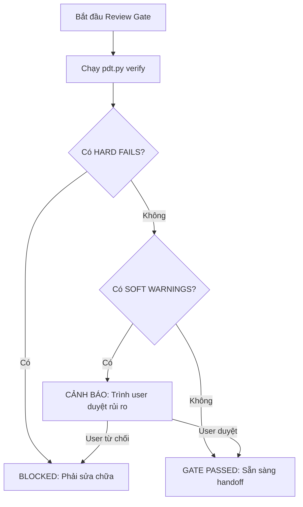

# Workflow: Review Gate

> Kiểm tra completeness, traceability, consistency trước khi cho phép chuyển sang Handoff.

## AUTOMATION TOOL

Trước khi thực hiện Review Gate thủ công, agent BẮT BUỘC chạy CLI check:
```bash
python scripts/pdt.py verify
```

CLI sẽ kiểm tra tự động:
- **Completeness**: Các file docs đã được điền đủ phần nội dung trong Completeness Tracker chưa.
- **Traceability**: REQ-IDs trong PRD đã được map tới SRS và TDD chưa.
- **Citation**: Có bị sót label "CHƯA CÓ DỮ LIỆU" nào không, tỷ lệ [Nguồn: ...] đạt bao nhiêu %.
- **Consistency**: So sánh chéo các screen trong Flows với Mockup pages.

---

## GATE CONDITIONS

Hệ thống đánh giá Review Gate chia làm 2 cấp độ:

1. **HARD FAILS (Bắt buộc phải sửa trước khi handoff)**:
   - Các tài liệu cốt lõi (PRD, SRS, TDD) bị trống hoặc ở status `superseded`.
   - Traceability Matrix của SRS/PRD có độ bao phủ dưới 80%.
   - Sót label "CHƯA CÓ DỮ LIỆU" ở các requirement Must-Have.
2. **SOFT WARNINGS (Handoff được nếu user chấp nhận rủi ro)**:
   - Thiếu flow diagram cho một số edge case của Should/Could Have.
   - Glossary chưa cập nhật đầy đủ thuật ngữ mới.
   - Tỷ lệ citation dưới 90% (nhưng trên 70%).



---

## OUTPUT FORMAT

Chạy review gate xong, agent xuất ra report có cấu trúc sau:

```markdown
## Review Gate Report

### 1. Kết quả từ pdt.py verify
[Dán output của command `python scripts/pdt.py verify` vào đây]

### 2. Đánh giá thủ công (Mockup Quality)
- [ ] Brief inference declared trong Mockups: [Pass/Fail]
- [ ] Dial values explicit (DESIGN_VARIANCE, MOTION_INTENSITY, VISUAL_DENSITY): [Pass/Fail]
- [ ] Color Consistency Lock & Page Theme Lock: [Pass/Fail]
- [ ] Responsive & Mobile Collapse checked: [Pass/Fail]
- [ ] Real images used (picsum / generated): [Pass/Fail]

### 3. Kết luận
- **Trạng thái**: [PASSED / FAILED / PASSED WITH WARNINGS]
- **Hành động tiếp theo**: [Handoff Package / Quay lại Step X để sửa lỗi / Chờ user confirm rủi ro]
```

---

## QUY TẮC

1. BẮT BUỘC chạy `python scripts/pdt.py verify` làm cơ sở đánh giá đầu tiên.
2. PHÂN LOẠI rõ ràng Hard Fails vs Soft Warnings để tránh block pipeline vô lý khi user chỉ cần draft nhanh.
3. LOG hoạt động duyệt gate:
   - `python scripts/pdt.py log --add "Review Gate: PASSED với 2 soft warnings" --artifact "Review Gate"`
4. UPDATE STATUS: Chạy `python scripts/pdt.py status --update` sau khi pass review gate.
