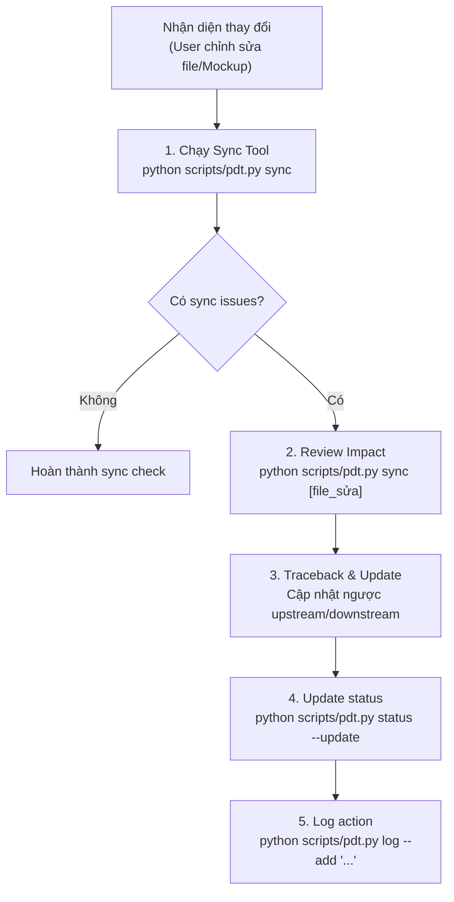

# Workflow: Sync Check

> Đồng bộ và cập nhật khi có artifact thay đổi (ví dụ: user sửa design, update ngược về srs/prd...).

## PIPELINE



## TIỀN ĐIỀU KIỆN
- Bất cứ khi nào user hoặc agent thực hiện chỉnh sửa cấu trúc, design, hoặc requirements của một artifact đã tồn tại.

---

## CHI TIẾT TỪNG STEP

### Step 1: Chạy Sync Tool
Chạy lệnh check toàn bộ:
```bash
python scripts/pdt.py sync
```
**Output**: Trả về danh sách các file đang bị stale (outdated) do upstream dependencies mới thay đổi.

---

### Step 2: Review Impact (Phân tích ảnh hưởng)
Chạy lệnh check chi tiết cho file vừa chỉnh sửa:
```bash
python scripts/pdt.py sync docs/prd/[tên_file].md
# hoặc mockup page
python scripts/pdt.py sync mockups/src/pages/[tên_page].tsx
```
**Output**: Danh sách các artifact downstream có nguy cơ bị stale cần review.

---

### Step 3: Traceback & Update (Cập nhật đồng bộ)
Thực hiện cập nhật ngược hoặc xuôi theo các quy tắc sau:

1. **Upward Sync (Cập nhật ngược)**:
   - Nếu sửa Mockup hoặc TDD dẫn đến thay đổi logic nghiệp vụ → Quay lại sửa **SRS** và **PRD** tương ứng để khớp thông tin.
   - Sử dụng tool `python scripts/pdt.py search [REQ-ID]` để tìm vị trí của các requirement liên quan trong PRD/SRS/TDD nhằm update đồng loạt.
2. **Downward Sync (Cập nhật xuôi)**:
   - Nếu sửa PRD/SRS → Cập nhật các component tương ứng trong **TDD** và code trong **Mockup**.
3. **Completeness Update**:
   - Update `Completeness Tracker` trong các file markdown vừa sửa đổi.

---

### Step 4: Update status
Đồng bộ trạng thái mới vào dashboard:
```bash
python scripts/pdt.py status --update
```

---

### Step 5: Log action
Ghi log hoạt động:
```bash
python scripts/pdt.py log --add "Đồng bộ SRS FR-001 sau khi sửa Mockup HomePage" --artifact SRS
```

---

## QUY TẮC
1. **TRACEABILITY LOCK**: Không được sửa đổi logic của requirement ở một file mà không cập nhật các file còn lại trong chain.
2. **TIMESTAMP DISCIPLINE**: Khi sửa file, luôn cập nhật trường `updated: YYYY-MM-DD` trong frontmatter để sync tool hoạt động chính xác.
3. **LOG REQUIREMENT**: Mọi update log liên quan đến thay đổi logic nghiệp vụ nên ghi rõ mã `REQ-XXX` hoặc `FR-XXX`.
