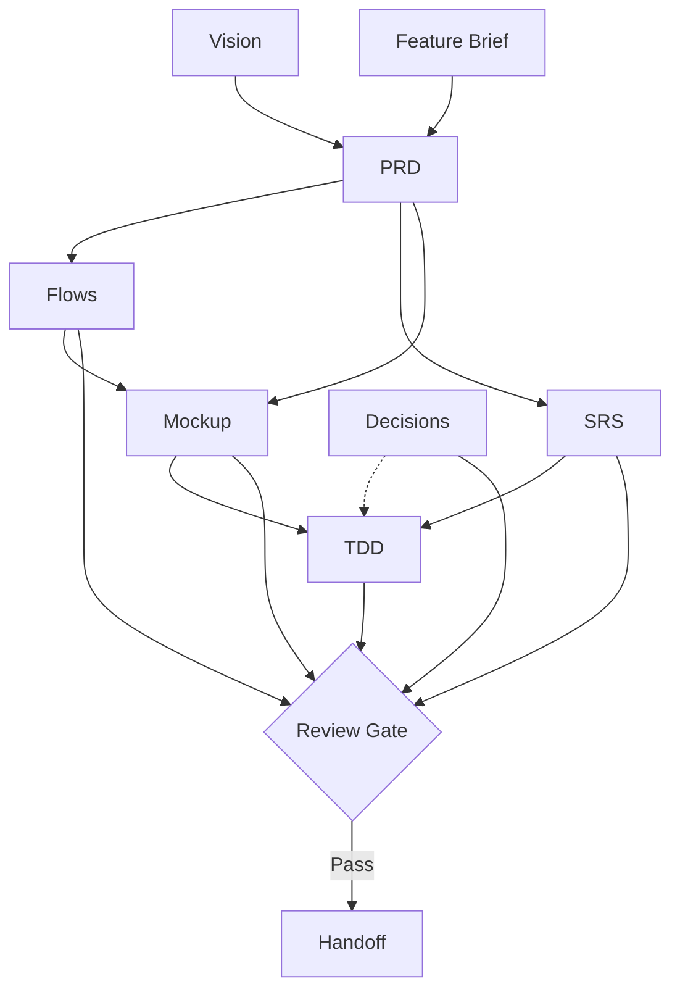

# Project Status Tracker

> Auto-generated by `python scripts/pdt.py status --update` on 2026-07-13
> Source of truth: frontmatter trong từng document.

---

## Artifact Status

| Artifact | File | Status | Completeness | Dependencies | Updated |
|---|---|---|---|---|---|
| Vision | — | ⬜ not started | — | ✅ | — |
| Feature Brief | — | ⬜ not started | — | ✅ | — |
| PRD | — | ⬜ not started | — | ⚠ Vision (not started), Feature Brief (not started) | — |
| Flows | — | ⬜ not started | — | ⚠ PRD (not started) | — |
| SRS | — | ⬜ not started | — | ⚠ PRD (not started) | — |
| Mockup | — | ⬜ not started | — | ⚠ Flows (not started), PRD (not started) | — |
| TDD | — | ⬜ not started | — | ⚠ SRS (not started), Decisions (not started) | — |
| Decisions | — | ⬜ not started | — | ✅ | — |

## Readiness

- **Handoff Ready**: 0/8 artifact types approved

## Dependency Graph

---
_Cập nhật: 2026-07-13 | Generate: `python scripts/pdt.py status --update`_
