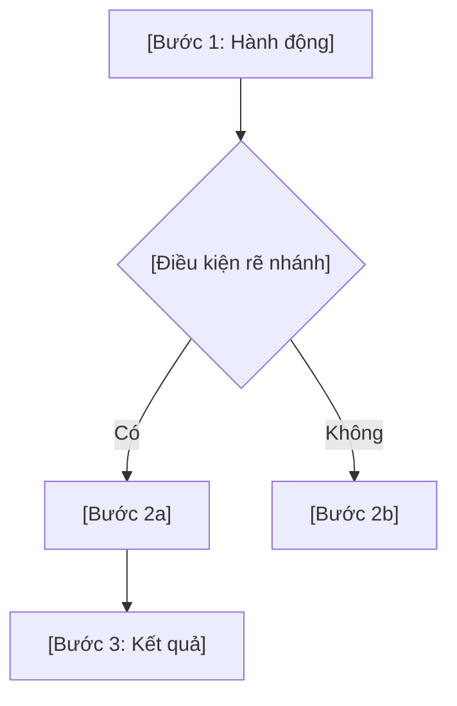
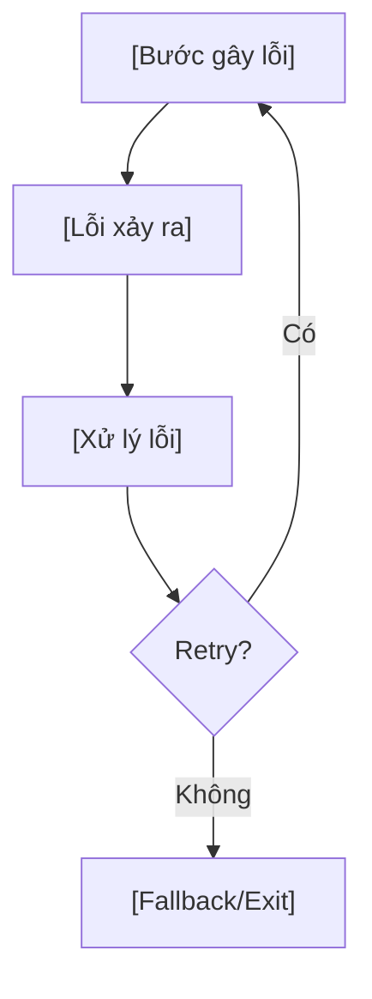

# [Tên Flow]

## Completeness Tracker
<!-- Agent cập nhật tự động khi viết/sửa sections -->
| Section | Status | Notes |
|---|---|---|
| 1. Mô tả | ⬜ todo | |
| 2. Actors | ⬜ todo | |
| 3. Preconditions | ⬜ todo | |
| 4. Happy Path | ⬜ todo | |
| 5. Error Paths | ⬜ todo | |
| 6. Postconditions | ⬜ todo | |
| 7. Liên kết | ⬜ todo | |

---

## Mô tả

_[1-2 câu mô tả mục đích flow]_
_[Nguồn: PRD REQ-XXX, "trích nguyên văn requirement"]_

## Actors

| Actor | Vai trò | Mô tả |
|---|---|---|
| _[Actor 1]_ | _[Primary/Secondary]_ | _[Mô tả ngắn]_ |

## Preconditions

- _[Điều kiện 1: ví dụ "User đã đăng nhập"]_
- _[Điều kiện 2]_

## Happy Path

### Chi tiết từng bước

| Bước | Actor | Hành động | Screen/API | Expected Result |
|---|---|---|---|---|
| 1 | _[Actor]_ | _[Hành động]_ | _[Screen/API]_ | _[Kết quả]_ |
| 2 | _[Actor]_ | _[Hành động]_ | _[Screen/API]_ | _[Kết quả]_ |

## Error Paths

### Error Path 1: [Tên - ví dụ: Network Timeout]

**Trigger**: _[Điều kiện gây lỗi]_

### Error Path 2: [Tên - ví dụ: Validation Failure]

_[Format tương tự Error Path 1]_

## Postconditions

- _[Kết quả khi flow hoàn thành thành công]_
- _[State changes]_

## Liên kết

| Loại | Reference |
|---|---|
| PRD | REQ-XXX, REQ-YYY |
| Mockup screens | _[Page names]_ |
| SRS | FR-XXX, FR-YYY |
| Related flows | _[Flow names]_ |

---

_Quy ước: Mỗi flow maximum 10 nodes trên happy path. Tách sub-flow nếu vượt. Minimum 2 error paths._
