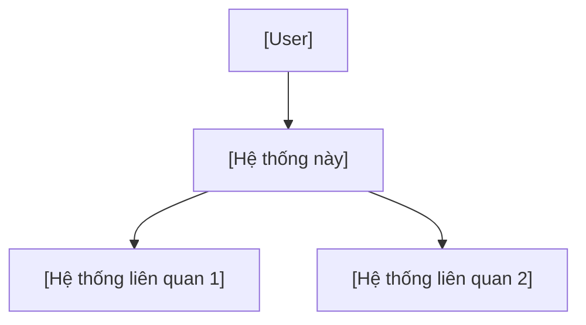
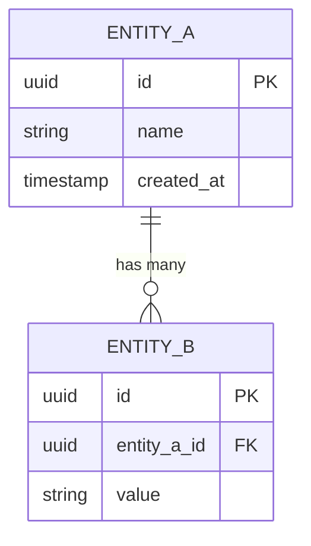

# Software Requirements Specification: [Tên Feature]

_Dựa trên IEEE 830-1998, điều chỉnh cho quy trình SDLC hiện đại._

---

## 1. Giới thiệu

### 1.1 Mục đích
_[Mục đích của tài liệu SRS này. Đối tượng đọc: ai cần đọc?]_

### 1.2 Phạm vi
_[Phạm vi phần mềm được đặc tả. Tên hệ thống/module.]_
_[Nguồn: PRD Section 4, "trích nguyên văn scope"]_

### 1.3 Định nghĩa & Viết tắt
_Xem [GLOSSARY.md](../GLOSSARY.md) cho danh sách đầy đủ._

| Thuật ngữ | Định nghĩa |
|---|---|
| _[Thuật ngữ]_ | _[Định nghĩa]_ |

### 1.4 Tài liệu tham chiếu
| Tài liệu | Vị trí | Phiên bản |
|---|---|---|
| PRD | docs/prd/[feature].md | 1.0 |
| Vision | docs/vision/VISION.md | 1.0 |

---

## 2. Mô tả tổng quan

### 2.1 Bối cảnh sản phẩm
_[Hệ thống/module này nằm ở đâu trong tổng thể? Tương tác với hệ thống nào?]_



### 2.2 Chức năng chính
_[Liệt kê các chức năng chính ở mức high-level. Mỗi chức năng trỏ về REQ-ID trong PRD.]_

1. _[Chức năng 1]_ → PRD REQ-001
2. _[Chức năng 2]_ → PRD REQ-002

### 2.3 Đặc điểm người dùng
_[Mô tả users sẽ tương tác với hệ thống. Reference PRD Section 3.]_

### 2.4 Ràng buộc
_[Ràng buộc kỹ thuật, pháp lý, business. Reference PRD Section 7.]_

### 2.5 Giả định & Phụ thuộc
_[Reference PRD Section 7+8.]_

---

## 3. Yêu cầu cụ thể

### 3.1 Yêu cầu chức năng

#### FR-001: [Tên yêu cầu]
- **Truy ngược**: PRD REQ-001
- **Mô tả**: _[Mô tả kỹ thuật chi tiết]_
- **Input**:
  - Field: _[Tên field]_
  - Type: _[Kiểu dữ liệu]_
  - Constraints: _[Ràng buộc: required, min/max, format]_
- **Processing**:
  1. _[Bước xử lý 1]_
  2. _[Bước xử lý 2]_
- **Output**:
  - _[Kết quả mong đợi, format]_
- **Error Handling**:
  | Error Case | Response | HTTP Status |
  |---|---|---|
  | _[Case 1]_ | _[Response]_ | _[Code]_ |
- **Performance**: Response time < _[X]_ ms ở p95

#### FR-002: [Tên yêu cầu]
_[Format tương tự FR-001]_

### 3.2 Yêu cầu phi chức năng

#### NFR-001: [Tên - Performance]
- **Truy ngược**: PRD REQ-XXX
- **Danh mục**: Performance
- **Metric**: _[Cụ thể - ví dụ: "API response time < 200ms ở p95 với 1000 concurrent users"]_
- **Phương pháp đo**: _[Tool: k6, Lighthouse, custom benchmark]_
- **Baseline hiện tại**: _[Hoặc "CHƯA CÓ DỮ LIỆU - cần benchmark"]_

#### NFR-002: [Tên - Security]
- **Truy ngược**: PRD REQ-XXX
- **Danh mục**: Security
- **Metric**: _[Cụ thể]_
- **Phương pháp đo**: _[Tool/method]_

#### NFR-003: [Tên - Availability]
_[Format tương tự]_

### 3.3 Yêu cầu giao diện

#### IR-001: User Interface
- **Truy ngược**: PRD REQ-XXX
- **Mô tả**: _[Screen/component requirements]_
- **Mockup reference**: `mockups/src/pages/[Page].tsx`
- **Accessibility**: WCAG 2.1 AA minimum

#### IR-002: API Interface
- **Truy ngược**: PRD REQ-XXX
- **Protocol**: REST / GraphQL / gRPC
- **Authentication**: _[Method]_
- **Rate limiting**: _[Limits]_

---

## 4. Mô hình dữ liệu

### 4.1 Entity Relationship Diagram



### 4.2 Data Dictionary

| Entity | Field | Type | Constraints | Mô tả | FR Ref |
|---|---|---|---|---|---|
| _[Entity]_ | _[Field]_ | _[Type]_ | _[NOT NULL, UNIQUE...]_ | _[Mô tả]_ | FR-001 |

---

## 5. Đặc tả giao diện ngoài

### 5.1 API Contracts

#### `POST /api/[resource]`
- **Mô tả**: _[Mô tả]_
- **FR Reference**: FR-001
- **Request**:
  ```json
  {
    "field": "type — constraint"
  }
  ```
- **Response 200**:
  ```json
  {
    "data": {}
  }
  ```
- **Error Responses**: Xem FR-001 Error Handling

### 5.2 UI Wireframe References

| Screen | Mockup | FR Refs | Mô tả |
|---|---|---|---|
| _[Screen]_ | `mockups/src/pages/[Page].tsx` | FR-001, FR-002 | _[Mô tả]_ |

---

## 6. Traceability Matrix

| PRD REQ-ID | SRS ID | Loại | Mô tả tóm tắt | Status |
|---|---|---|---|---|
| REQ-001 | FR-001 | Functional | _[Mô tả]_ | Draft |
| REQ-001 | NFR-001 | Non-Functional | _[Mô tả]_ | Draft |
| REQ-002 | FR-002 | Functional | _[Mô tả]_ | Draft |
| REQ-003 | IR-001 | Interface | _[Mô tả]_ | Draft |

### Coverage Check
- Total PRD REQs: _[N]_
- Mapped in SRS: _[M]_
- Coverage: _[M/N × 100]_%
- Unmapped REQs: _[Liệt kê hoặc "Không có"]_

---

_Quy ước: FR = Functional Requirement, NFR = Non-Functional Requirement, IR = Interface Requirement, DR = Data Requirement._
