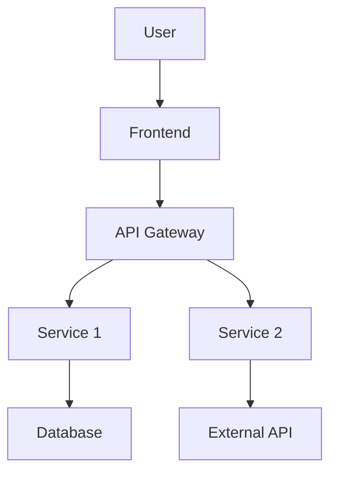
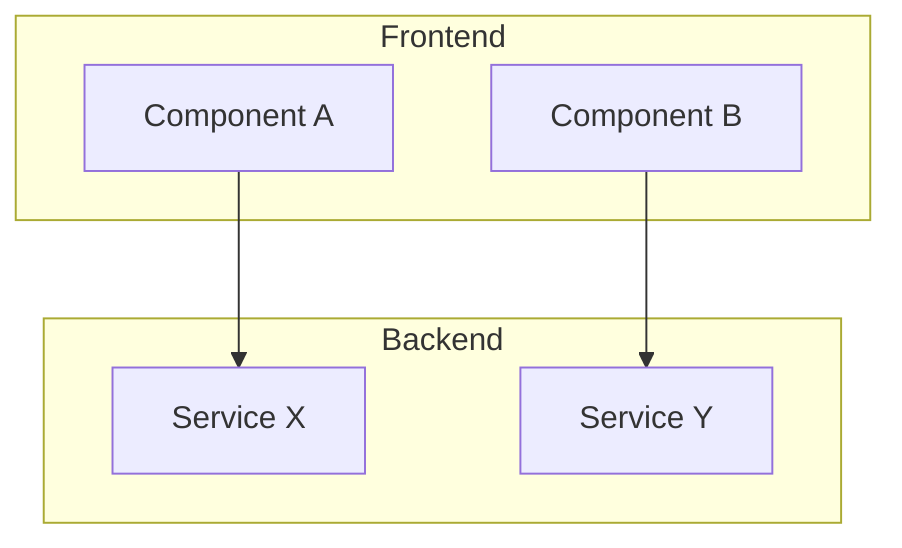
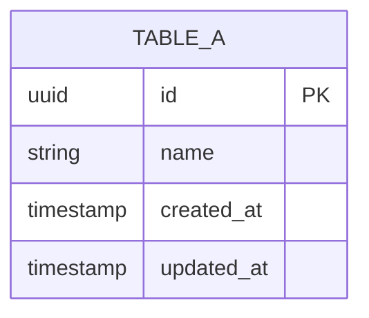

# Technical Design Document: [Tên Feature]

## Completeness Tracker
<!-- Agent cập nhật tự động khi viết/sửa sections -->
| Section | Status | Notes |
|---|---|---|
| 1. Tổng quan kiến trúc | ⬜ todo | |
| 2. Component Design | ⬜ todo | |
| 3. Data Model | ⬜ todo | |
| 4. API Design | ⬜ todo | |
| 5. Security | ⬜ todo | |
| 6. Performance | ⬜ todo | |
| 7. Trade-off Analysis | ⬜ todo | |
| 8. Monitoring & Analytics | ⬜ todo | |
| 9. Deployment | ⬜ todo | |

---

## 1. Tổng quan kiến trúc

### 1.1 Context Diagram



### 1.2 Tương tác với hệ thống hiện có
_[Mô tả integration points]_
_[Nguồn: SRS Section 2.1]_

### 1.3 Quyết định kiến trúc
_[Reference ADR-IDs liên quan]_
| ADR | Quyết định | Ảnh hưởng |
|---|---|---|
| ADR-XXX | _[Decision]_ | _[Components affected]_ |

---

## 2. Component Design

### 2.1 Component Diagram



### 2.2 Chi tiết từng Component

#### Component: [Tên]
- **Trách nhiệm**: _[Single responsibility - 1 câu]_
- **SRS Reference**: FR-001, FR-002
- **Interface**:
  ```typescript
  interface [ComponentName] {
    // Public API
  }
  ```
- **Dependencies**: _[Components phụ thuộc]_
- **Data Flow**: Input → Processing → Output
- **Error Handling**: _[Strategy]_

---

## 3. Data Model

### 3.1 Entity Relationship Diagram



_[Nguồn: SRS Section 4]_

### 3.2 Data Dictionary

| Entity | Field | Type | Constraints | Index | Mô tả |
|---|---|---|---|---|---|
| _[Entity]_ | _[Field]_ | _[Type]_ | _[Constraints]_ | _[Y/N]_ | _[Mô tả]_ |

### 3.3 Migration Strategy
_[Cách migrate từ schema hiện tại, nếu có. Rollback plan.]_

---

## 4. API Design

### 4.1 Endpoints

| Method | Path | Mô tả | Auth | Rate Limit | SRS Ref |
|---|---|---|---|---|---|
| _[Method]_ | _[Path]_ | _[Mô tả]_ | _[Y/N]_ | _[Limit]_ | FR-XXX |

### 4.2 Request/Response Schemas

#### `[METHOD] [PATH]`
**Request:**
```json
{
  "field": "type"
}
```

**Response 200:**
```json
{
  "data": {}
}
```

### 4.3 Error Codes

| Code | Mô tả | Client Action |
|---|---|---|
| 400 | _[Detail]_ | _[Action]_ |
| 401 | _[Detail]_ | _[Action]_ |
| 404 | _[Detail]_ | _[Action]_ |
| 500 | _[Detail]_ | _[Action]_ |

---

## 5. Security

### 5.1 Authentication & Authorization
_[Strategy. Reference ADR nếu có.]_
_[Nguồn: SRS NFR-XXX]_

### 5.2 Data Protection
- **At rest**: _[Encryption method]_
- **In transit**: _[TLS version, cert management]_
- **PII handling**: _[Nếu có]_

### 5.3 Input Validation
| Endpoint | Field | Validation Rule |
|---|---|---|
| _[Endpoint]_ | _[Field]_ | _[Rule]_ |

---

## 6. Performance

### 6.1 Performance Budget

| Metric | Target | Baseline | SRS Ref | Đo bằng |
|---|---|---|---|---|
| Response Time (p95) | < 200ms | _[Hiện tại]_ | NFR-XXX | _[Tool]_ |
| Throughput | _[X]_ req/s | _[Hiện tại]_ | NFR-XXX | _[Tool]_ |
| Page Load (LCP) | < 2.5s | _[Hiện tại]_ | NFR-XXX | Lighthouse |

### 6.2 Caching Strategy

| Layer | Technology | TTL | Invalidation | Data |
|---|---|---|---|---|
| _[Layer]_ | _[Redis/CDN/Memory]_ | _[TTL]_ | _[Strategy]_ | _[What's cached]_ |

### 6.3 Scalability Plan
_[Horizontal/vertical scaling strategy. Bottleneck analysis.]_

---

## 7. Trade-off Analysis

### Trade-off 1: [Tên quyết định]

| Tiêu chí | Option A: [Tên] | Option B: [Tên] |
|---|---|---|
| Performance | _[Rating + evidence]_ | _[Rating + evidence]_ |
| Complexity | _[Rating + evidence]_ | _[Rating + evidence]_ |
| Maintainability | _[Rating + evidence]_ | _[Rating + evidence]_ |
| Cost | _[Rating + evidence]_ | _[Rating + evidence]_ |

**Quyết định**: Option _[X]_
**Lý do**: _[Giải thích, reference ADR-XXX]_

---

## 8. Monitoring & Analytics

### 8.1 Metrics
| Metric | Type | Alert Threshold | Dashboard |
|---|---|---|---|
| _[Metric]_ | Counter/Gauge/Histogram | _[Threshold]_ | _[Dashboard]_ |

### 8.2 Logging
- **Format**: Structured JSON
- **Levels**: ERROR → WARN → INFO → DEBUG
- **Retention**: _[Days]_

### 8.3 Alerting
| Condition | Severity | Channel | Runbook |
|---|---|---|---|
| _[Condition]_ | P1/P2/P3 | _[Slack/PagerDuty]_ | _[Link]_ |

### 8.4 Analytics Integration (Telemetry)
_Mapping từ PRD Section 6.2 (Telemetry Plan) sang implementation._
- **SDK/Tool sử dụng**: _[Mixpanel/Amplitude/Google Analytics...]_
- **Implementation Strategy**: _[Ví dụ: Bắn event ở frontend hay backend? Sử dụng queue để tránh block request?]_

| Event Name | Mapping Component/Endpoint | Ghi chú kỹ thuật |
|---|---|---|
| `button_clicked` | `Frontend/ComponentA.tsx` | Đảm bảo truyền đủ context props |

---

## 9. Deployment

### 9.1 Deployment Strategy
_[Blue-green / canary / rolling. Lý do chọn.]_

### 9.2 Rollback Plan
1. _[Step 1]_
2. _[Step 2]_
3. _[Step 3]_

### 9.3 Feature Flags
| Flag | Mô tả | Default | Owner |
|---|---|---|---|
| _[Flag name]_ | _[Mô tả]_ | OFF | _[Team]_ |

---

_Quy ước: Mỗi section reference SRS FR/NFR IDs. Mỗi trade-off reference ADR-IDs._
